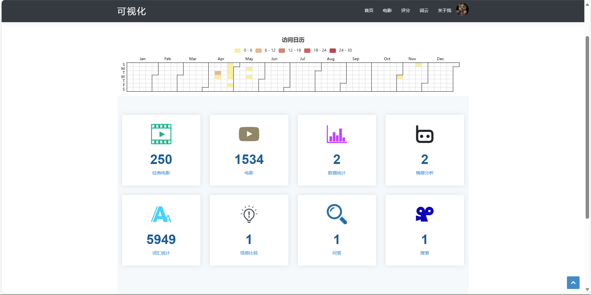
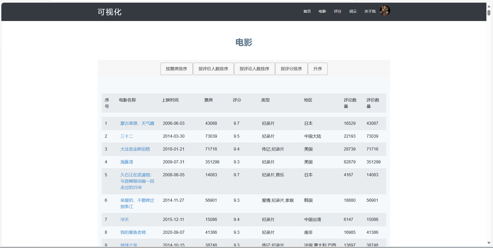
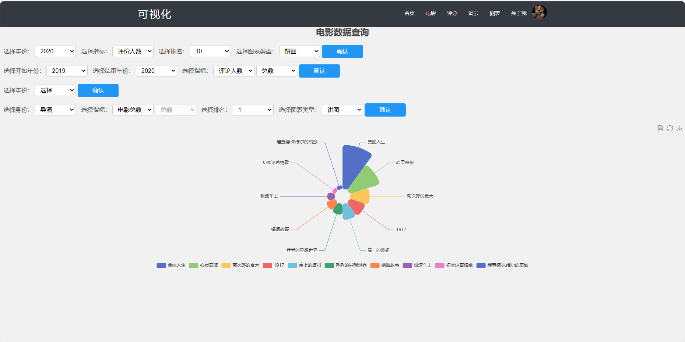
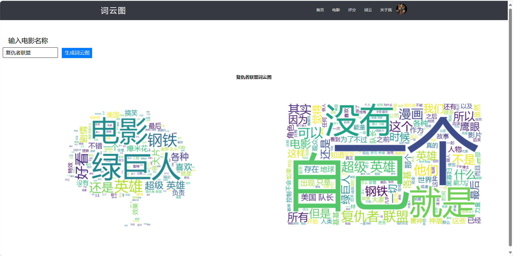
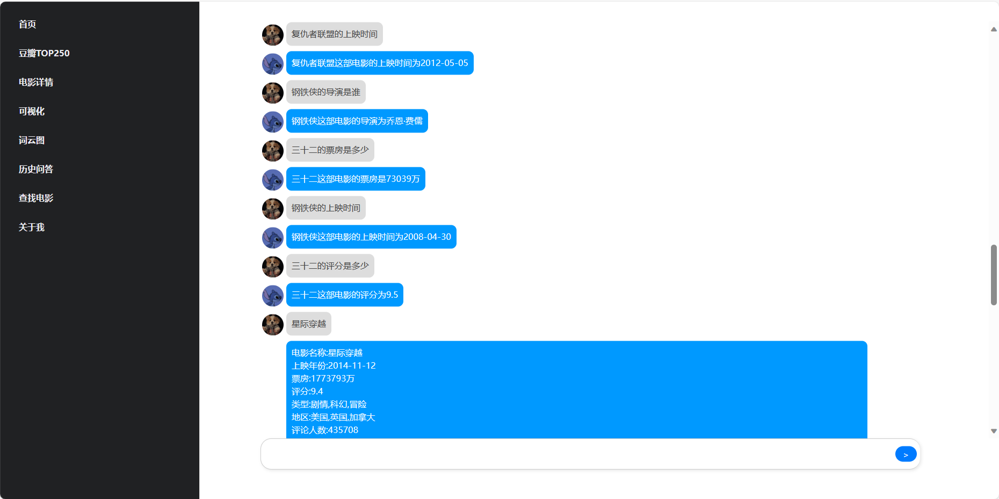
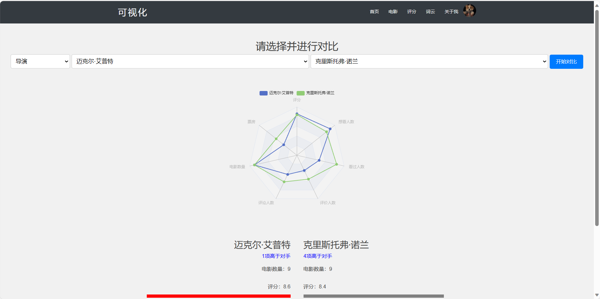
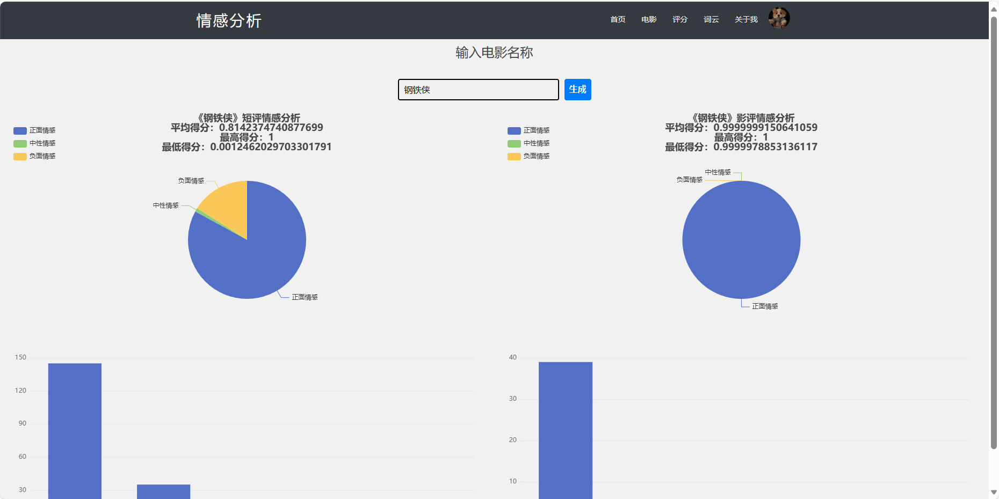

# Python爬取豆瓣电影 使用flask框架可视化数据

## 项目技术栈：`Flask框架、Echarts、WordCloud、SQLite`

## 环境设置 确保安装 Python 3.x，并且已安装以下依赖（见 `requirements.txt` 文件）。

## 目录结构说明

│ app.py ----- flask框架文件  

│ ... .py ----- 其他功能文件 

│ database ----数据  
&emsp;&emsp; ----cloud.db  
&emsp;&emsp; ----feedback.db  
&emsp;&emsp; ----pythonMovie.db  
&emsp;&emsp; ----userInfo.db  
&emsp;&emsp; ----sentiment.db

│ README.md

│ requirements.txt ----- 依赖包环境版本

├─static ----- 静态页面

├─templates ----- HTML页面

└─venv ----- 虚拟环境  

**具体函数功能如下：**

| 文件                  | 简要描述功能                      |
| ------------------- |-----------------------------|
| app.py              | 构建一个电影信息分析系统的Flask应用。       |
| movies.py           | 处理电影相关请求，包括获取电影数据和渲染页面。     |
| newAnwser.py        | 实现一个电影相关问题的问答系统。            |
| compare.py          | 处理电影、导演和演员信息的对比和获取。         |
| other_functions.py  | 包含其他功能的路由处理函数，如回答问题、历史回答、执行代码等。 |
| sentiment.py        | 实现电影情感的可视化展示。               |
| movies_score.py     | 从数据库中获取电影评分等信息，并执行相关操作。     |
| selfDefiningFile.py | 读取电影数据库文件，提取电影名称并分词。        |
| user.py             | 定义Flask应用中的用户对象和相关属性。       |
| user_validation.py  | 验证用户信息是否存在于数据库中。            |
| wordcloud.py        | 处理生成词云图的相关请求和数据。            |
| signup_login.py     | 处理用户注册和登录功能。                |
| charts.py           | 处理与图表相关的路由请求和图表数据。          |


## 运行方式

运行以下命令启动 Flask 服务器：

```bash
python3 app.py
```

**项目托管于以下地址，点击访问：<a href="http://47.236.122.152:5000">47.236.122.152:5000</a>**

**由于github限制，电影数据无法完整上传，部分功能可能无法正常使用，想要完整数据的请联系。**

目前仅上传了可视化代码，爬虫代码有时间再整理上传，后续将持续更新...

有任何问题请联系**QQ1797834904**

## 页面展示









